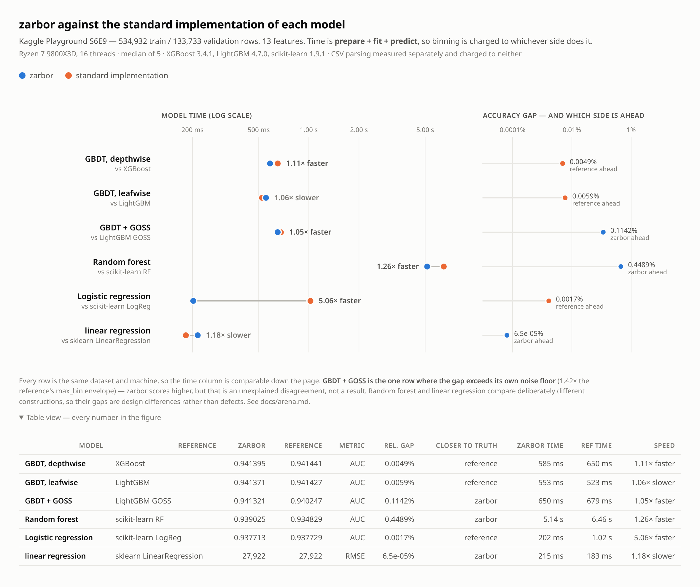

# zmodels

Gradient-boosted trees, random forests and regularised linear models for
tabular CSV data, in Zig with no dependencies. Plus cross-validation and
hyperparameter search as first-class subcommands, so the whole loop runs in
one process instead of a Python harness shelling out per fold.

    zig build -Doptimize=ReleaseFast

    ./zig-out/bin/zgbdt train.csv --label=y --save=m.zm
    ./zig-out/bin/zgbdt predict test.csv --model=m.zm --out=p.csv
    ./zig-out/bin/zgbdt cv   train.csv --label=y --folds=5
    ./zig-out/bin/zgbdt tune train.csv --label=y --search=bayes --trials=60
    ./zig-out/bin/zgbdt profile train.csv

## Is this worth using instead of LightGBM?

Sometimes, and `docs/why.md` answers it with measurements rather than
enthusiasm: where zarbor is at parity (the GBDT models), where it is genuinely
ahead (random forest, linear), the one thing it does that no LightGBM setting
can (an independent model in a blend, worth -0.00206 RMSE at 20/20 seeds), and
what maintaining it actually costs. Short version: for the best tabular score
with the least effort, use LightGBM; use both when the score matters most.

## Reading a file

`src/csv.zig` is a module on its own because parsing is not a model: every
algorithm here pays it before it sees a bin.

**A missing marker only means "missing" in a column whose other values are
numbers.** `NA`, `N/A`, `NaN`, `null`, `none`, `nil`, `?` and the empty field
are recognised, and the column decides what they mean. In the Ames housing
data `LotFrontage` holds numbers and `NA`, so the `NA` is an unrecorded
frontage; `PoolQC` holds `Ex`/`Gd`/`TA` and `NA`, where the data dictionary
defines `NA` as the level **"No Pool"**. Applying either reading globally is
wrong: pandas' default converts 14 of that file's columns from a documented
category to "unknown", while treating every marker as a level makes
`MasVnrArea` a 328-level categorical and the file will not load at all.

**The schema outranks the file at prediction time.** `predict` used to
re-sniff column kinds from the file it was handed, even though the model had
stored them. A slice can carry no usable evidence about a column while being
valid data -- a 298-row holdout of House Prices where every `PoolQC` happened
to be `NA` sniffed numeric where training had it categorical, and failed with
`FeatureKindMismatch`. `readCsvHinted` pins the kinds the model names and
sniffs the rest.

`zgbdt profile <data.csv>` reports what is in a file without training on it --
per column the kind, missing count, distinct values, min/median/max and a
count past the Tukey outer fence; then a footer naming values that failed to
parse after the sniff window, columns that cannot inform a split, and
categoricals too wide for a `u8` bin. Every train and `cv` run prints the
one-line version beside its read timing, because that is what catches a file
read wrong before a bad score gets blamed on the model.

Measured honestly: on House Prices the per-column rule is worth nothing
against blanking every marker -- `gbdt` -0.00023 (p = 0.27), `linear` -0.00004
(p = 0.86), `random_forest` -0.00012 (p = 0.28), 20 paired fold seeds each.
Everything here trains on the binned matrix, where a missing entry is already
a distinguishable state -- bin 0 for a tree, the dropped reference level for
the linear design. Naming that state costs and buys nothing. The change is a
**loading fix, not an accuracy fix**. See `docs/parsing.md`.

## Models

**A missing value with no training examples goes to the larger child.** Bin 0
holds missing and `bestSplit` scans each feature twice, once each way, so the
direction is learned per split. Where a feature has no missing rows at a node
both scans score identically, so the winner used to fall out of loop order
(`missing_left = true`, always) -- and that flag is what routes a missing value
at *prediction* time, where a column complete in training routinely has holes.
Sending it to the larger child instead is the smaller bet. Measured on House
Prices by blanking holdout cells only, in columns complete in training, 60
seeds: at the competition's own rate the new build holds 0.13580 where the old
drifts to 0.13596 (p = 0.005); at 5% blanked, 0.14381 against 0.16722; at 20%,
0.17470 against 0.29577. The chosen thresholds are unchanged, so a file with
no missing values scores bit-identically -- and skipping the redundant scan is
12.3% faster on california, 10.1% on House Prices, 5.5% on adult.

One core — histogram binning, categorical dictionaries, NaN-as-missing,
L1+L2, row and feature sampling, a thread pool — because XGBoost and LightGBM
*are* one algorithm with a different node-selection rule, and a forest tree is
a boosting tree fed `g = -y, h = 1` with shrinkage off.

| `--algo` | what it is |
|---|---|
| `gbdt` (default) | XGBoost-style depthwise boosting |
| `gbdt --grow_policy=lossguide --sampling=goss` | LightGBM-style |
| `random_forest` | bagged unshrunk trees, `sqrt(p)` features per split |
| `linear` | the two standard simple models: **logistic regression** (`--objective=logistic`) and **linear regression / OLS** (`--objective=squared_error`). L-BFGS with OWL-QN for L1; `--lin_solver=adam` as a first-order fallback. See `docs/linear-solvers.md`. |

Every `Config` field is exposed as `--field=value` by comptime reflection, so
the flag surface and the struct cannot drift apart.

## Cross-validation

`zgbdt cv` reads and bins once, then loops folds over the binned matrix.
**`--repeats=N` extends that across fold seeds** -- N consecutive assignments
over the same binned matrix, reporting the spread. One fold assignment on a
small table is mostly noise, and reconstructing the spread by relaunching the
process per seed re-reads the CSV and re-quantises every column for a
permutation that never touched either. The compute saving is honestly small
(0.9% on a 1,460-row file, 2.5% on 49k x 15) because the parser is fast; the
point is that the tool reports the spread instead of a shell loop stitching it
together.
It reports the **pooled** out-of-fold score — every row predicted by the one
model that did not train on it — alongside the per-fold mean and sd, because
those answer different questions and get conflated. Folds are stratified for a
classification objective.

**`--group-col=NAME` holds out whole groups.** Whenever a unit appears in
more than one row -- a panel, repeated measures, the same ZIP in two months --
row-wise folds put one row in training and its sibling in validation, and the
score measures memory rather than generalisation. Measured on a two-month
panel of 6,830 ZIP codes: row-wise CV reports RMSE 10.51 where holding out
whole ZIPs reports 14.17. The column is dropped as a feature automatically.

Predictions are pooled on the natural scale, not raw log-odds: each fold is a
different model with its own base score, and a metric over the pooled vector
compares rows *across* folds, so the scale has to mean the same thing in all
of them.

## Hyperparameter search

`--search` picks between four families that differ in what they assume:

| | assumption | cost |
|---|---|---|
| `grid` | none | product of the axes; re-tests an important knob once per combination of the unimportant ones |
| `random` | few parameters matter | every trial gives each knob a fresh value |
| `bayes` | good configs cluster | TPE: Parzen density over good vs bad, proposing where the ratio peaks |
| `bandit` | a cheap score ranks like an expensive one | successive halving over fold count |

The space is declared, not hard-coded:

    --param=max_depth=4,5,6,7        # explicit choices
    --param=lambda=0.1..50:log       # log-uniform range
    --param=n_rounds=200..800:int    # integer range

Values are rendered back through the same reflection that defines the flag
surface, so `tune` can vary any `Config` field — including ones added later —
without knowing anything about it.

**`--confirm=N` re-scores the leaders on fold seeds they never saw.** The
headline number is the maximum of many trials on one split and is optimistic
by construction; the confirmed one is what to believe. The tuner also re-runs
its own winner and warns if the reported configuration does not reproduce.

## Properties worth knowing

- **Deterministic across `--n_threads`.** Results are bit-identical, which
  means anything parallel groups floating-point additions by a *fixed* chunk
  count rather than one per thread. A test asserts it.
- **Models serialise.** A `.zm` carries the model *and* the binning schema,
  because a categorical bin *is* its dictionary id — without the level strings
  a second file would bin the same category differently. Round trips are
  bit-identical.
- **Targets encode by sorted class order**, matching scikit-learn's
  `LabelEncoder`. Encoding by order of first appearance silently fits the
  inverse model on a positive-class-first file. `--pos-label=NAME` overrides.
- **`zig build` defaults to Debug, which is ~8x slower.** Every run prints its
  build mode so a benchmark cannot quietly measure the wrong binary.

## Two things measured rather than assumed

Both are off by default, both were pre-registered before they were written,
and neither met the bar it was given. `docs/PROTOCOL.md` fixes the datasets,
the fixed hyperparameters and the success criterion; `docs/RESULTS.md` has the
numbers; `docs/categorical-splits.md` and `docs/linear-leaves.md` carry the
derivations. `bench/run.py` reproduces the grid.

    --cat_split=optimal    partition a categorical by gradient order rather
                           than by a cut on its dictionary id
    --linear_leaves=1      fit an affine function of the root-to-leaf numeric
                           features in each leaf instead of a constant

`--cat_split=optimal` helps where categorical columns carry a real share of
the signal (Ames, −1369 RMSE) and does nothing where the widest categorical
has 12 levels. It is close to free, 1.05–1.25x. Its real limit is the `u8`
bin: a column with 256+ levels is refused outright, so this does nothing
whatever for high-cardinality keys.

`--linear_leaves=1` helps squared-error regression (California, −0.0060 RMSE)
and hurts logistic classification on every set tried, at 1.3–2.2x the fit time.
The leaf value is a log-odds there, and an affine function of a raw feature has
nothing holding it in at the edge of a leaf.

## Not implemented, deliberately

LightGBM's EFB and CatBoost's ordered boosting.

## Benchmarks

`bench/compare.py` pits each model against its reference (xgboost, lightgbm,
scikit-learn) on one shared split, both charged for binning and neither for
validation. It takes any CSV, and it exists because comparing against a
reference implementation means running it.

`bench/arena/arena.py` asks the same question on one large, clean dataset
(Kaggle S6E9, 668,665 x 13, zero nulls) and adds what a one-shot comparison
cannot give: a noise floor per row, a referee that rescores the reloaded `.zm`
rather than trusting either side's metric, and a per-phase time breakdown.
Protocol in `docs/PROTOCOL-arena.md`, results in `docs/arena.md`.

Binning is charged to whoever does it: XGBoost and LightGBM bin inside
`fit()`, zarbor bins before it, so the speed column is prepare + fit +
predict on both sides. Parsing belongs to no model and is measured on its own.

| model | reference | AUC gap | zarbor model work |
|---|---|---:|---:|
| gbdt depthwise | xgboost | 0.000046 (0.05 envelopes) | 1.08x faster |
| gbdt leafwise | lightgbm | 0.000056 (0.05 envelopes) | **1.07x slower** |
| gbdt + GOSS | lightgbm | 0.001074 (1.42 env) &rarr; 0.000149 with `--goss_rank=gradient_hessian` | 1.04x faster |
| random_forest | sklearn | 0.004197 ahead | 1.21x faster |
| linear | sklearn | 0.000016 | 5.93x faster |

| | zarbor | reference |
|---|---:|---:|
| CSV parse, 40 MB | 135 ms | pandas 177 ms |

Three findings worth the reading: the GOSS row's gap turned out to be
LightGBM ranking rows by `|g*h|` where the paper says `|g|` (`docs/goss.md`); LightGBM's leafwise fit is genuinely faster
than zarbor's once binning is charged symmetrically; and forest *prediction*
(279 ms against sklearn's 87) is the largest single deficit measured.

`bench/arena/scoreboard.py` merges every model-vs-counterpart comparison onto
one dataset and one machine, and `bench/arena/make_figure.py` renders it as a
standalone interactive figure (`bench/arena/scoreboard.html`, previewed in
`bench/arena/fig_light.png`) -- dumbbell for time on a log axis, a companion
panel for the accuracy gap with the leading side named, a full table view and
light/dark modes.

The two harnesses overlap and should be consolidated.

## License

MIT. See `LICENSE`.
